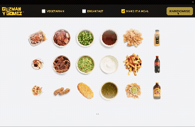
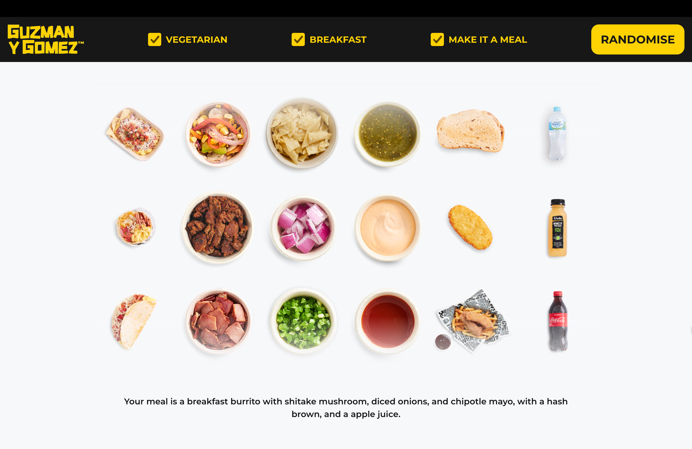
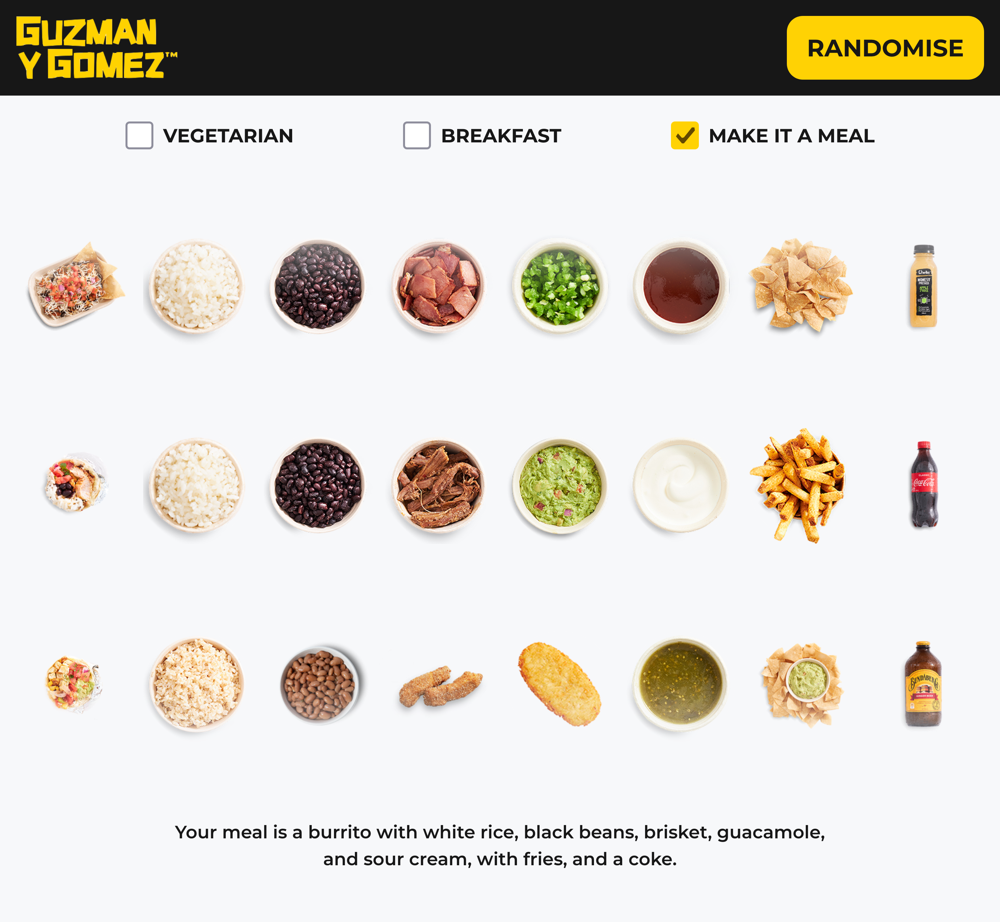
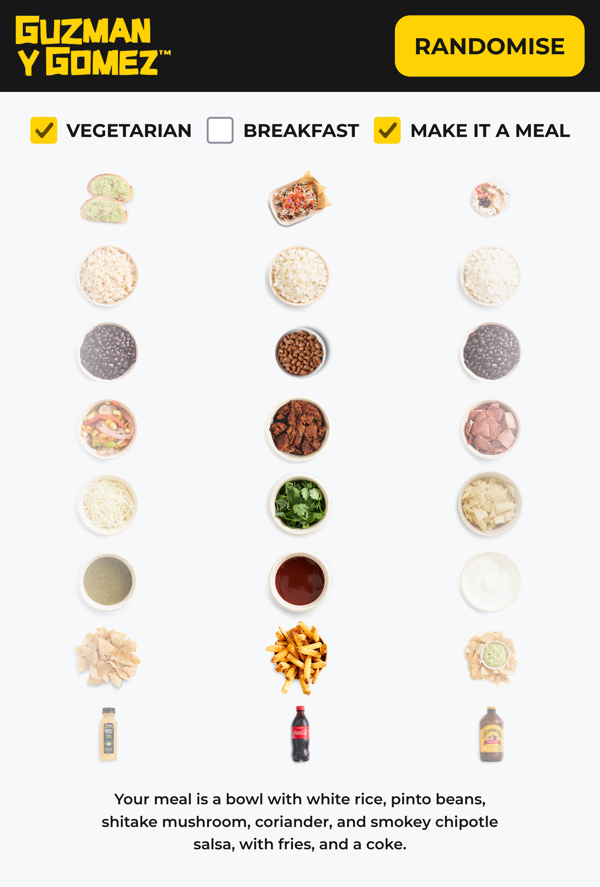

# Summary

This repository contains a Guzman Y Gomez order randomiser built using React and Vite.

It randomly generates a:

- entree (burrito, bowl, nachos)
- protein (chicken, pork, vegetables)
- addition (guacamole, onions, jalapenos)
- sauce

Entrees have different randomised categories depending on what can be added to them (e.g. burritos also randomise rice and beans).

The app also includes a:

- toggle for vegetarian and breakfast options
- a meal toggle that also returns a drink and side
- formatting for desktop, tablet and mobile device screens

**Desktop View**

**Tablet View**

**Mobile View**

## Disclaimer

This is a personal programming project created for learning and portfolio purposes.

It is inspired by fast-casual restaurant ordering systems but is not affiliated with or
endorsed by Guzman y Gomez in any way.

All trademarks and brand names are the property of their respective owners.
